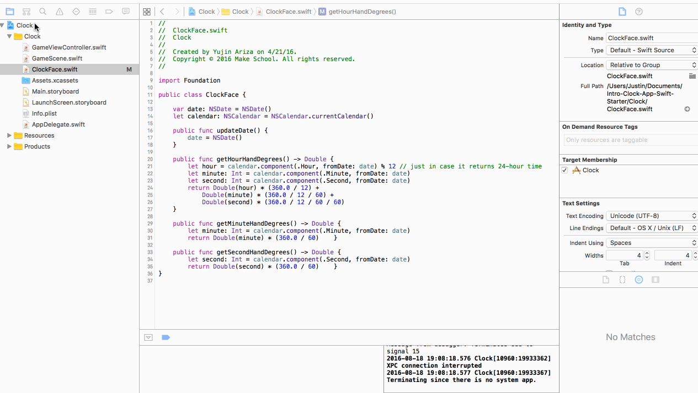

#Intro-Clock-App-Swift-Starter

##What you will learn

- Using functions
- Type casting
- Understanding objects(basics)
- Using class methods & return statements
- Arithmetic conversions

##Common issues

- Take your time to fully grasp how the hour function works..specifically the return statement.
- To make sure the build runs on your phone, you must also change the bundle identifier. Watch below to see how you change it.
    
    

##What you should understand when finished

- How to write functions that execute specific code inside of them.
- Type casting from one type to another
- Return statements
   